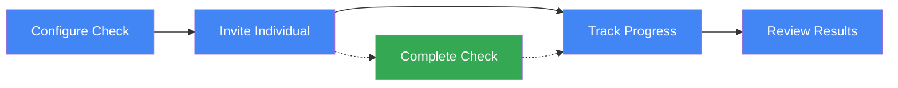
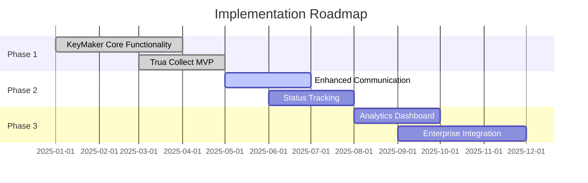
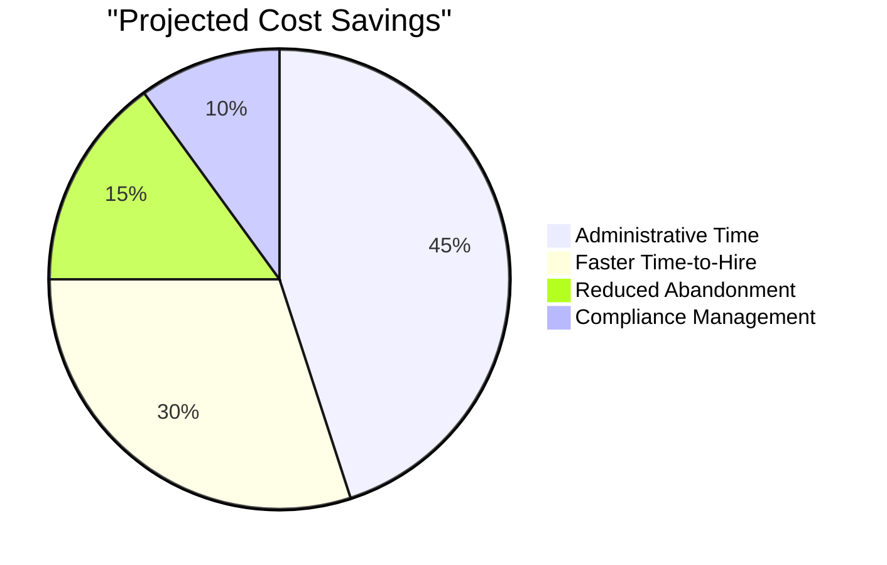

# Executive Overview: KeyMaker & Trua Collect

## Vision

KeyMaker and Trua Collect form an end-to-end solution for configuring, managing, and completing background checks. This integrated platform streamlines the entire process from initial configuration to final verification, reducing administrative overhead and improving completion rates.

## Business Value

- **Reduced Time-to-Hire**: Accelerate onboarding by up to 40% through streamlined background checks
- **Increased Completion Rates**: Improve completion rates from industry average of 70% to over 90%
- **Lower Administrative Costs**: Reduce administrative overhead by 60% through automation
- **Enhanced Compliance**: Ensure consistent adherence to regulatory requirements
- **Improved Candidate Experience**: Provide a modern, mobile-friendly interface for candidates

## Solution Components

### KeyMaker

KeyMaker is the configuration and management hub that allows organizations to:

1. **Configure Background Checks**: Create standardized background check configurations using a simple interface
2. **Manage Invitations**: Send and track invitations to individuals requiring background checks
3. **Monitor Progress**: Track completion status and analytics in real-time
4. **Generate Reports**: Create compliance and performance reports

### Trua Collect

Trua Collect is the candidate-facing application that:

1. **Guides Candidates**: Walks individuals through the background check process step-by-step
2. **Collects Information**: Securely gathers required personal information and documentation
3. **Verifies Identity**: Ensures the individual's identity through multi-factor verification
4. **Provides Updates**: Keeps candidates informed of their progress and next steps

## Workflow

1. **Configure Check** (KeyMaker): HR configures background check requirements
2. **Invite Individual** (KeyMaker): System sends invitation to candidate
3. **Complete Check** (Trua Collect): Candidate completes background check process
4. **Track Progress** (KeyMaker): HR monitors completion status
5. **Review Results** (KeyMaker): HR reviews and approves final results

## Key Features

### Multi-Channel Communication
- Email and SMS notifications
- Automated reminders
- Customizable templates

### Real-Time Status Tracking
- Progress dashboards
- Status notifications
- Completion analytics

### Secure Integration
- Encrypted data transfer
- Webhook-based status updates
- Comprehensive audit trails

### Analytics & Reporting
- Completion rates and times
- Channel effectiveness
- Compliance reporting

## Implementation Timeline

- **Phase 1** (Q1-Q2 2025): Core functionality deployment ✓
- **Phase 2** (Q2-Q3 2025): Enhanced communication and tracking
- **Phase 3** (Q3-Q4 2025): Analytics and enterprise integration

## ROI Projection

- **Year 1**: 2.5x ROI through administrative savings and faster hiring
- **Year 2**: 4x ROI with full implementation and process optimization
- **Year 3**: 5x+ ROI with enterprise integration and analytics-driven improvements

## Next Steps

1. **Complete Phase 2 Development** (Q3 2025)
   - Implement multi-channel communication
   - Enhance status tracking capabilities

2. **Begin Enterprise Pilot** (Q4 2025)
   - Select 2-3 key enterprise customers
   - Implement feedback loop for continuous improvement

3. **Full Market Release** (Q1 2026)
   - Complete analytics dashboard
   - Launch enterprise integration capabilities

## Executive Sponsors

- **Product Owner**: Sarah Johnson, VP of Product
- **Technical Lead**: Michael Chen, CTO
- **Implementation Lead**: David Rodriguez, Director of Customer Success