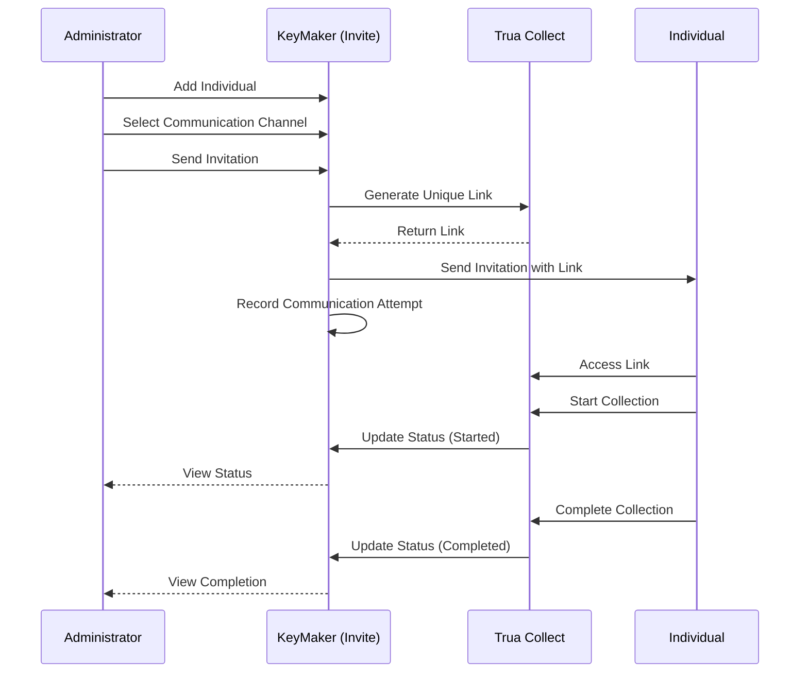
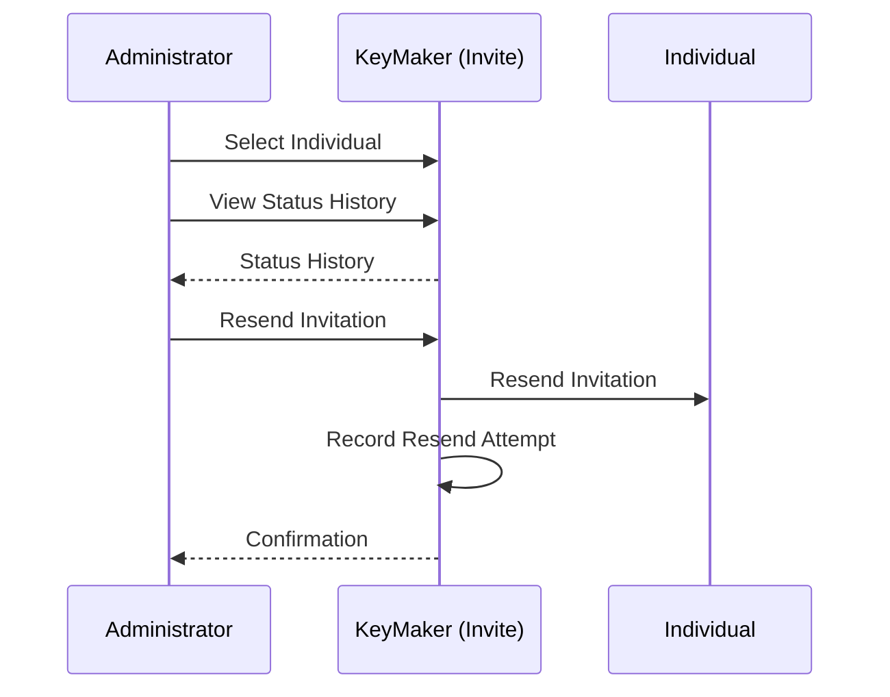
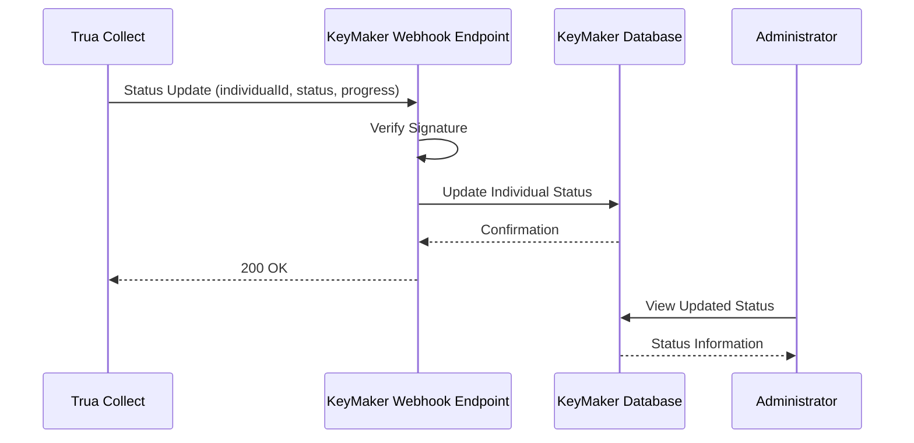
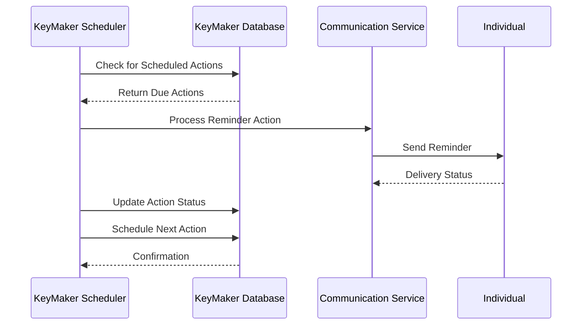
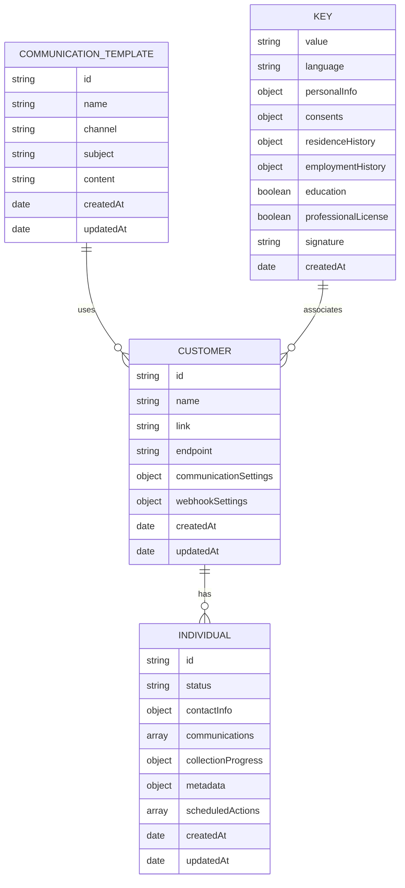

# Sequence Diagrams
## Invite Process Flow
## Invite and Track Process Flow

The following sequence diagrams illustrate the interaction between the KeyMaker application, Trua Collect, and the individual during the invitation and collection process.

### 1. Invitation and Collection Process

### 2. Resend Invitation Process

### 3. Webhook Status Update Process

### 4. Scheduled Reminder Process

### 5. Entity Relationship Diagram

These Mermaid diagrams illustrate the key interactions between the different components of the system during the invitation and collection process, as well as the data relationships. They provide a visual representation of the data flow and the responsibilities of each component.