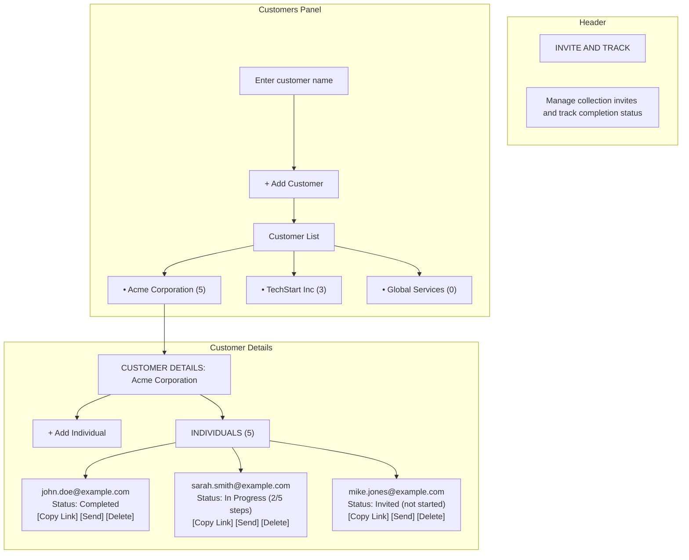
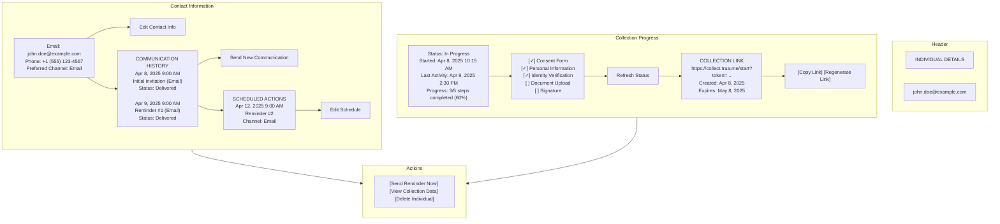
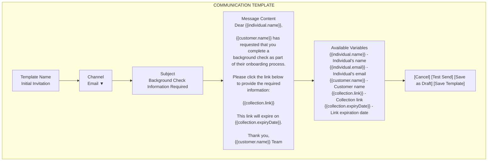
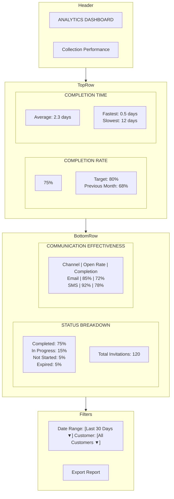

# UI Mockups: Enhanced Invite

## Overview
This document provides UI mockups for the enhanced Invite functionality. These mockups illustrate the user interface for the new features described in the future requirements document.
This document provides UI mockups for the enhanced Invite and Track functionality. These mockups illustrate the user interface for the new features described in the future requirements document.
## 1. Main Invite Dashboard
## 1. Main Invite and Track Dashboard

## 2. Add Individual Modal with Enhanced Options

```mermaid
graph TD
    subgraph AddIndividualModal["ADD INDIVIDUAL"]
        EmailField["Email Address<br>john.doe@example.com"]
        PhoneField["Phone Number (optional)<br>+1 (555) 123-4567"]
        ChannelField["Preferred Communication Channel<br>Email ▼"]
        
        SendOptions["Send Invitation Immediately<br>○ Yes<br>● No, schedule for later"]
        
        ScheduleSection["Schedule Date and Time<br>04/15/2025 ▼ | 10:00 AM ▼"]
        
        ReminderSection["Reminder Settings<br>[✓] Send reminder if not completed<br>Frequency: Every [3] days<br>Maximum reminders: [5]"]
        
        ExpirationSection["Expiration<br>[✓] Set expiration date<br>Expire after [30] days"]
        
        ButtonSection["[Cancel] [Add Individual]"]
        
        EmailField --> PhoneField
        PhoneField --> ChannelField
        ChannelField --> SendOptions
        SendOptions --> ScheduleSection
        ScheduleSection --> ReminderSection
        ReminderSection --> ExpirationSection
        ExpirationSection --> ButtonSection
    end
```

## 3. Individual Detail View with Status Tracking

## 4. Communication Template Editor

## 5. Analytics Dashboard

These Mermaid diagrams provide a visual representation of the enhanced Invite functionality, including the new features for communication management, status tracking, and analytics. They serve as a guide for the implementation of the user interface and user experience for the enhanced system.
These Mermaid diagrams provide a visual representation of the enhanced Invite and Track functionality, including the new features for communication management, status tracking, and analytics. They serve as a guide for the implementation of the user interface and user experience for the enhanced system.